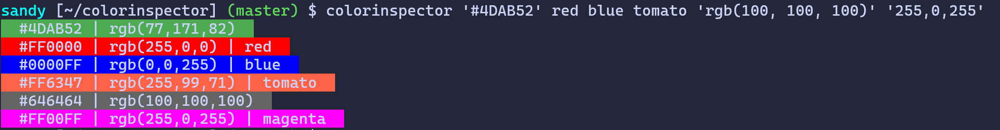

# TUI Color inspector

A simple TUI color inspector that prints out the colors that you pass as arguments, colored with the color itself.

Supports all HTML colors, hexadecimal, and RGB.



## Usage

```
$ colorinspector
Usage: colorinspector <color1> [color2 ...]
Supported formats:
  - HTML color names (e.g., 'red', 'blue')
  - Hex values e.g., '#FF0000', '#f00', case insensitive
  - RGB values e.g., 'rgb(255,0,0)' or '255, 0, 0', space insensitive
```

## Build

`go build colorinspector.go`.
